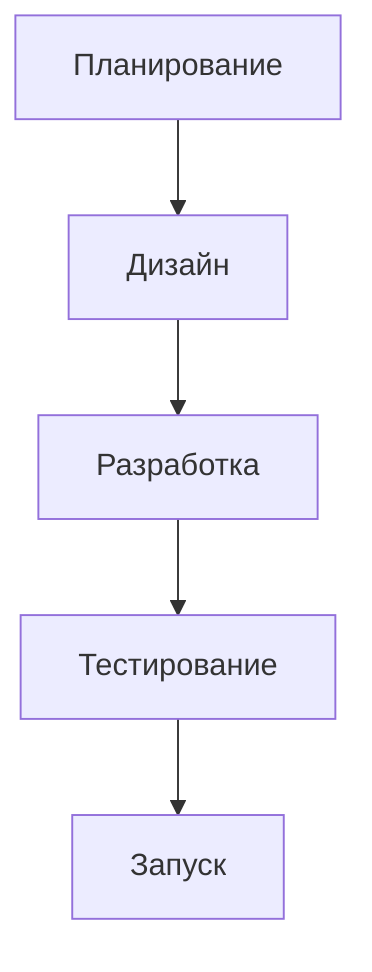

 🎓 IThub College - Система управления учебными проектами


---

 🤐 Описание проекта

Веб-платформа для управления студенческими проектами в колледже IThub. Система позволяет отслеживать прогресс проектов, назначать задачи и координировать работу между студентами и преподавателями.

 👥 Для кого предназначен проект:
- Студенты IThub - разработчики, дизайнеры, менеджеры
- Преподаватели и кураторы - контроль выполнения работ  
- Администрация колледжа - отслеживание проектной деятельности

###  Основные функции:
✅ Создание и ведение учебных проектов
✅ Назначение ролей в команде (менеджер, разработчик, дизайнер)
✅ Контроль сроков и дедлайнов
✅ Система отчетности и отслеживания прогресса
✅ Хранение всей проектной документации

---

  Установка и запуск

  Что потребуется:
- Компьютер с Windows/Mac/Linux
- Браузер (Chrome, Firefox, Edge)  
- Доступ в интернет

  Как начать пользоваться:
1. Перейдите на сайт системы (адрес будет добавлен после развертывания)
2. Зарегистрируйтесь используя вашу учебную почту IThub
3. Создайте первый проект - заполните основную информацию
4. Пригласите团队成员 - добавьте участников по их email
5. Начните работу - создавайте задачи и отслеживайте прогресс

---

  Примеры использования

  Для менеджера проекта:
```
Проект: "Разработка интернет-магазина"
Команда: 
- Менеджер: Иванов Алексей
- Frontend-разработчик: Петрова Мария
- Backend-разработчик: Сидоров Дмитрий  
- Дизайнер: Кузнецова Анна

Этапы работы:
1. Анализ требований 
2. Прототипирование  (в процессе)
3. Разработка  (ожидание)
4. Тестирование  (ожидание)
```

  Для разработчика:
-  Просмотр назначенных задач
-  Отметка о выполнении этапов
-  Загрузка готового кода
-  Коммуникация с командой

---

 📁 Структура репозитория

```
IThub-Project-Management
├── 📄 README.md
├── 📁 docs
├── 📁 presentations
├── 📁 research
└── 📁 assets
```

---

  Технические требования

  Для использования системы:
- Браузер: Chrome 90+, Firefox 88+, Safari 14+
- Интернет: стабильное соединение
- Устройство: ПК, ноутбук, планшет

 🔧 Для разработки (если потребуется):
- Язык программирования: JavaScript
- Фреймворк: React
- База данных: MongoDB
- Платформа: Node.js

---

  Авторы и участники

  Команда проекта:

Иванов Алексей - *Project Manager*
-  Управление проектом
-  Документация и отчетность  
-  Коммуникация с заказчиком

Петрова Мария - *Frontend Developer*
-  Разработка пользовательского интерфейса
-  Верстка и визуальное оформление

Сидоров Дмитрий - Backend Developer
-  Серверная часть приложения
-  База данных и API

Кузнецова Анна - UI/UX Designer
-  Дизайн интерфейса
-  Прототипирование и用户体验

---

  Контактная информация

  По вопросам сотрудничества:
-  Email: projects@ithub.ru
-  Telegram: @IThubProjects  
-  GitHub: github.com/IThub-Student

  Техническая поддержка:
-  Email: support@ithub.ru
-  Чат в системе управления проектами

---

  Статус проекта

| Показатель | Значение |
|------------|----------|
| Статус |  В разработке |
| Версия | 1.0.0 |
| Обновление | Декабрь 2024 |

---

<div align="center">

*Проект разработан в рамках учебной программы колледжа IThub*

 IThub College - Готовим профессионалов цифровой эпохи!*
<br>
<br>

---

<div align="center">

##  Быстрые контакты и статус

<table>
<tr>
<td>

 Мои контакты
Абрамов Михаил
<br>
Project Manager IThub

📧 `Cunchula@ithub.ru`
<br>
📱 `@Mihail_ithub`
<br>
💼 `LinkedIn профиль`

</td>
<td>

 Статус проекта

 Активно развивается

</td>
</tr>
</table>

<br>

🔧 Технологии: `React` `Node.js` `MongoDB` `Git` `Figma`

 Нравится проект? Поставьте звезду!

<br>

---

<small>Проект выполнен в рамках учебной программы колледжа IThub</small>

</div>
 Форма опроса для одногруппников:

1. Оцените удобство интерфейса от 1 до 10
2. Были ли сложности с навигацией по системе?
3. Какие функции показались наиболее полезными?
4. С какими ошибками или проблемами столкнулись?
5. Что бы вы добавили или улучшили в системе?
6. Порекомендовали бы вы эту систему другим студентам?
7. Общие комментарии и предложения
